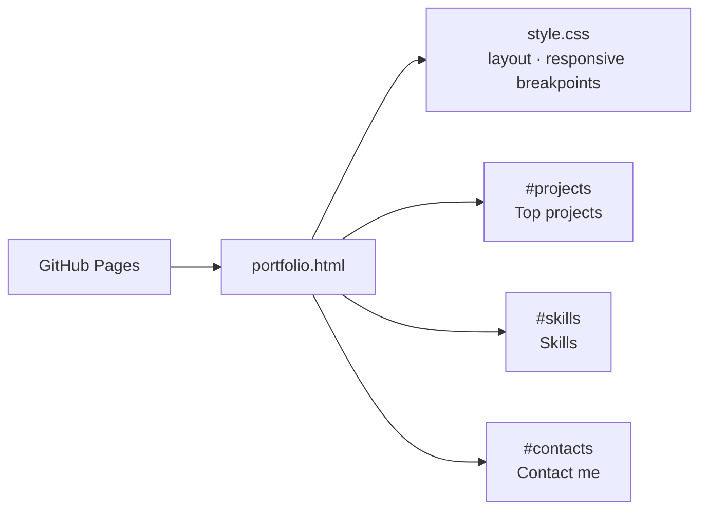

# Portfolio Website

VISIT : https://nakultt.github.io/Portfolio-Website/portfolio.html

This is the repository for my personal portfolio website. It showcases my skills, projects, and contact information.

## Table of Contents

- [Overview](#overview)
- [Technologies Used](#technologies-used)
- [Getting Started](#getting-started)
- [Features](#features)

## Overview

This portfolio website serves as a platform to display my work and achievements. It is built using **HTML** and **CSS** and is designed to be responsive and visually appealing.

## Technologies Used

- **HTML**: Structuring the content on the website.
- **CSS**: Styling and layout design.

## Features

- Fully responsive design.
- Clean and modern layout.
- Sections for:
  - About Me
  - Projects
  - Skills
  - Contact Information

## Architecture

The site is a single static page with no build step, served by GitHub Pages.



| File | Purpose |
|---|---|
| `portfolio.html` | Page markup and section anchors for in-page navigation |
| `style.css` | Typography, layout and responsive rules |
| `favicon.png` | Site icon |

## Getting started

```bash
git clone https://github.com/nakultt/Portfolio-Website.git
cd Portfolio-Website
# open portfolio.html in a browser, or:
python -m http.server 8000   # http://localhost:8000/portfolio.html
```
